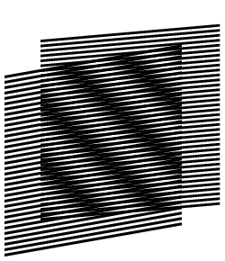
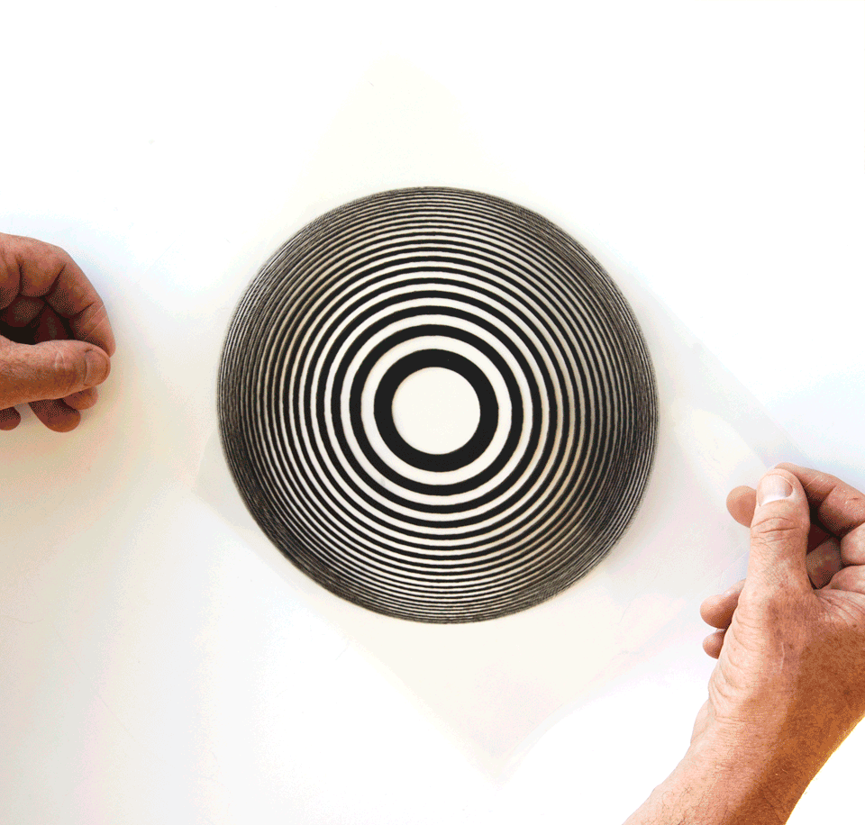

# Moiré Phased Array

This project demonstrates beam steering in phased arrays using the Moiré effect, based on the principles described in the paper: [https://arxiv.org/pdf/2107.05571](https://arxiv.org/pdf/2107.05571).

## 🌟 Showcase

Here are some examples of Moiré patterns:

| Moiré Pattern 1 | Moiré Pattern 2 |
| :---: | :---: |
|  |  |

## 🚀 Usage

The `main.py` script generates a GIF (`moire_scan.gif`) that visualizes various Moiré patterns and their corresponding beam steering.

To run the script, execute the following command in your terminal:

```bash
python main.py
```

## 📦 Dependencies

This project requires the following Python libraries:

- **NumPy**: For numerical operations.
- **Matplotlib**: For plotting and creating animations.

You can install these dependencies using pip:

```bash
pip install numpy matplotlib
```

## ✨ How to Add the Generated GIF

After running the `main.py` script, a new file named `moire_scan.gif` will be created in the root directory of the project. To add this GIF to the "Showcase" section, follow these steps:

1. Move the `moire_scan.gif` file to the `assets` directory.
2. Open the `README.md` file and add the following line to the "Showcase" section:

```markdown
| Generated Moiré Patterns |
| :---: |
|  |
```

This will display the generated GIF alongside the existing examples, providing a comprehensive view of the Moiré effect in action.

## 📄 Implementation Example

For an example of how these principles can be applied to low-cost satellite user terminals, see this paper: [Implementation Example](https://ieeexplore.ieee.org/abstract/document/9444281/).


